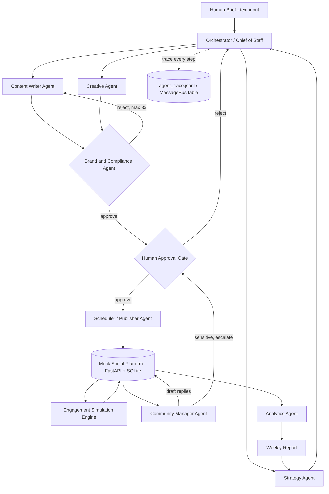

# Prodigal AI Task 1 — Technical Architecture & Build Spec
### Multi-Agent Social Media AI Company — Implementation Reference

This document is written to be handed directly to an AI coding assistant (Claude Code, Cursor, etc.) as the source of truth for building the system. It defines the tech stack, repo layout, data models, API contracts, agent specs, orchestration logic, and the engagement simulation rules. Treat every section as a build requirement, not a suggestion.

---

## 1. Tech Stack

| Layer | Choice | Why |
|---|---|---|
| Language | Python 3.11+ | Fastest path per the brief; strong local LLM + data tooling |
| Local model runtime | Ollama (local HTTP API, `http://localhost:11434`) | Required by the brief |
| Primary model | `qwen2.5:7b-instruct` (or `llama3.1:8b-instruct`) | Good instruction-following at 7-8B, runs on consumer hardware |
| Router/classifier model | `qwen2.5:3b-instruct` or `phi3.5:3.8b` | Fast, cheap, used for routing/classification/validation, not generation |
| Orchestration | Custom-built (no LangGraph/CrewAI) — a lightweight state machine + message bus | Full control over the reject-loop and trace logging; easy to defend line-by-line in Round 2. *(If time-pressed, LangGraph is an acceptable fallback — document the tradeoff either way.)* |
| Structured output enforcement | Pydantic v2 models + JSON schema passed in-prompt + `instructor`-style retry-until-valid loop (hand-rolled, no hosted dependency) | Local models frequently emit malformed JSON — this must be handled explicitly, not hoped away |
| Backend / Mock platform API | FastAPI | Async, auto-generates OpenAPI docs, plays well with SQLAlchemy |
| Database | SQLite via SQLAlchemy ORM (async, `aiosqlite`) | Brief explicitly allows SQLite; persistent, zero-config |
| Agent-to-agent messaging | A `MessageBus` table in SQLite (append-only log) + in-process async queue for live runs | Gives you both a live message bus AND a durable trace log for the write-up "show your agent conversation" requirement |
| CLI / demo runner | Typer + Rich | Clean CLI viewer for the mock platform and for triggering campaign runs, satisfies "API + CLI viewer is acceptable" |
| Optional minimal UI | Streamlit (single page: feed viewer + weekly report viewer) | Plus, not required — cheap to add on Day 4 if time allows |
| Testing | pytest | For the simulation engine and validation logic specifically — this is where bugs hide |
| Env/config | `pydantic-settings` + `.env` | Model names, Ollama host, hardware notes all config-driven, not hardcoded |
| Logging | Python `logging` + structured JSON lines to `logs/agent_trace.jsonl` | This file *is* your "show the agent conversation" deliverable |
| Packaging | `pyproject.toml` + `uv` or `pip` + `requirements.txt` | Reproducibility — must run from README on a clean clone |

**No hosted LLM APIs, no hosted embedding APIs.** If embeddings are used for memory/RAG, use a local embedding model via Ollama (e.g. `nomic-embed-text`) or `sentence-transformers` running fully offline.

---

## 2. High-Level Architecture



**Core design principle:** every agent-to-agent handoff is a row in the `MessageBus` table AND a line in `agent_trace.jsonl`. Nothing moves between agents silently in-process only — this is what makes the "show your agent conversation" deliverable trivial to produce later, and it's what a reviewer will check first.

---

## 3. Repository Structure

```
prodigal-task1/
├── README.md
├── WRITEUP.pdf                     # generated last, from writeup/writeup.md
├── requirements.txt / pyproject.toml
├── .env.example
├── docker-compose.yml              # optional: ollama + app services
├── run_demo.py                     # single entrypoint: brief in -> full week -> report out
│
├── config/
│   └── settings.py                 # pydantic-settings: model names, ollama host, retry limits
│
├── models/                         # Pydantic schemas — shared contract between agents
│   ├── campaign.py                 # Campaign, ContentPillar, KPISet
│   ├── post.py                     # Post, CreativeBrief, ScheduleSlot
│   ├── review.py                   # ComplianceVerdict, RejectionReason
│   ├── engagement.py                # EngagementSnapshot, Comment
│   └── report.py                   # WeeklyReport, PostInsight, Recommendation
│
├── llm/
│   ├── ollama_client.py            # thin wrapper: streaming, retries, token accounting
│   ├── structured_output.py        # validate-against-pydantic-or-retry loop
│   └── prompts/                    # one .txt/.jinja per agent, versioned
│       ├── orchestrator.jinja
│       ├── strategy.jinja
│       ├── writer.jinja
│       ├── creative.jinja
│       ├── compliance.jinja
│       ├── community_manager.jinja
│       └── analytics.jinja
│
├── agents/
│   ├── base_agent.py                # shared: call model, validate, log to trace, emit message
│   ├── orchestrator.py
│   ├── strategy_agent.py
│   ├── writer_agent.py
│   ├── creative_agent.py
│   ├── compliance_agent.py
│   ├── scheduler_agent.py
│   ├── community_manager_agent.py
│   └── analytics_agent.py
│
├── orchestration/
│   ├── message_bus.py               # append-only bus: publish(), subscribe(), history()
│   ├── state_machine.py             # campaign lifecycle states + transition rules
│   └── retry_policy.py              # max-3-rejections-then-escalate logic
│
├── platform/                        # the mock social media platform itself
│   ├── main.py                      # FastAPI app
│   ├── db.py                        # SQLAlchemy engine/session
│   ├── schema.py                    # ORM models: Channel, Post, Metric, Comment, Follower
│   ├── routes/
│   │   ├── posts.py                 # POST /posts, GET /feed
│   │   ├── metrics.py               # GET /posts/{id}/metrics
│   │   └── comments.py              # GET /posts/{id}/comments, POST reply
│   └── simulation/
│       ├── engine.py                # applies hidden rules to generate engagement
│       └── hidden_rules.py          # the 6 planted signals, documented + toggleable
│
├── memory/
│   └── campaign_memory.py           # local vector store (sqlite-vec or simple embedding+cosine) of past campaign learnings
│
├── cli/
│   └── viewer.py                    # Typer + Rich: view feed, view report, replay trace
│
├── logs/
│   └── agent_trace.jsonl            # generated at runtime — the "show the conversation" artifact
│
├── tests/
│   ├── test_simulation_engine.py    # hidden rules produce expected statistical effects
│   ├── test_structured_output.py    # malformed-JSON retry logic
│   └── test_state_machine.py        # reject loop terminates correctly
│
├── seed_data/
│   └── demo_brief.txt               # the espresso machine example from the brief
│
└── writeup/
    ├── writeup.md                   # source for the required PDF
    ├── architecture_diagram.png
    └── sample_run_transcript.md
```

---

## 4. Core Data Contracts (Pydantic Models)

These are the objects that flow between agents. Every agent reads/writes only these — no free-text handoffs.

```python
# models/campaign.py
class KPISet(BaseModel):
    metric: str                 # e.g. "click_through_rate"
    target: float
    channel: str | None = None

class ContentPillar(BaseModel):
    name: str
    description: str
    weight: float                # % of posts allocated to this pillar

class Campaign(BaseModel):
    id: str
    brief_raw: str
    objective: str
    target_audience: str
    channel_mix: list[str]
    duration_days: int
    content_pillars: list[ContentPillar]
    kpis: list[KPISet]
    status: Literal["draft","pending_human_approval","approved","running","reviewed"]
    created_at: datetime

# models/post.py
class CreativeBrief(BaseModel):
    asset_type: Literal["image","video","carousel","text_only"]
    description: str             # text brief, no real image gen required

class Post(BaseModel):
    id: str
    campaign_id: str
    channel: str
    copy: str
    hashtags: list[str]
    cta: str | None
    creative: CreativeBrief
    scheduled_at: datetime
    compliance_status: Literal["pending","approved","rejected"]
    rejection_count: int = 0
    published_post_id: str | None = None   # set once live on mock platform

# models/review.py
class ComplianceVerdict(BaseModel):
    post_id: str
    verdict: Literal["approve","reject"]
    reasons: list[str]
    banned_terms_hit: list[str] = []

# models/report.py
class PostInsight(BaseModel):
    post_id: str
    performance_rank: Literal["top","bottom","mid"]
    hypothesis: str

class Recommendation(BaseModel):
    change: str                  # must be specific: "shift Channel B 09:00->18:30"
    evidence: str
    expected_effect: str

class WeeklyReport(BaseModel):
    campaign_id: str
    week_number: int
    kpi_performance: dict[str, float]
    post_insights: list[PostInsight]
    patterns_found: list[str]
    comment_sentiment_summary: str
    recommendations: list[Recommendation]
```

---

## 5. Mock Platform — API Contract

FastAPI app, SQLite-backed. Minimum endpoints (brief-mandated ones marked **required**):

| Method | Path | Purpose |
|---|---|---|
| POST | `/channels` | seed the 3 channel types (short-form video / discussion / professional) |
| POST | `/posts` | **required** — publish a post to a channel |
| GET | `/feed?channel=` | **required** — fetch a channel's feed |
| GET | `/posts/{id}/metrics` | **required** — fetch simulated engagement for a post |
| GET | `/posts/{id}/comments` | **required** — fetch simulated comments |
| POST | `/posts/{id}/comments/{comment_id}/reply` | Community Manager posts a reply |
| POST | `/simulate/tick` | advance simulated time by N hours/days, triggering the engagement engine |
| GET | `/analytics/week/{campaign_id}/{week}` | raw aggregated data for the Analytics Agent to read |

### DB Schema (SQLAlchemy models, `platform/schema.py`)

- `Channel(id, name, type, character_profile_json)` — character_profile stores per-channel modifiers (e.g. "penalizes copy > 150 words")
- `Post(id, campaign_id, channel_id, copy, hashtags_json, cta, format, published_at)`
- `Metric(post_id, impressions, likes, comments, shares, saves, clicks, follower_delta, recorded_at)`
- `Comment(id, post_id, author_handle, text, sentiment, is_sensitive, replied)`
- `SimulationState(campaign_id, current_sim_time, format_history_json)` — tracks recent format repeats for the novelty-decay rule

---

## 6. Engagement Simulation Engine — Hidden Rules (Plant These, Document Them)

Implement in `platform/simulation/engine.py`, each rule as an independent, toggleable function so you can report per-rule discovery rate later. Suggested 6 rules:

1. **Time-window boost:** posts published 18:00–21:00 local get a 1.4–1.8x reach multiplier vs. baseline; 02:00–06:00 gets a 0.5x penalty.
2. **Question-CTA comment lift:** posts whose copy ends in `?` get 2–3x expected comment count (Poisson lambda scaled).
3. **Non-linear hashtag effect:** reach peaks at 3–5 hashtags; 0 hashtags underperforms, 8+ hashtags triggers a penalty (simulating "looks spammy").
4. **Channel-specific length penalty:** the "professional" channel penalizes copy > 150 words by ~30% reach; the "short-form video" channel penalizes copy > 60 words by ~40%.
5. **Novelty decay:** if the same `format` (e.g. same creative asset_type) is used 3+ days running on the same channel, apply a compounding 15%/day reach decay until format changes.
6. **Follower-delta correlation with saves:** posts with high save-rate (>5% of impressions) get a disproportionate follower_delta boost, simulating algorithmic promotion — a subtler, second-order signal that's genuinely hard for the Analytics Agent to find, intentionally.

Each function takes `(post, channel_profile, recent_history) -> multiplier`, multipliers compose multiplicatively onto a noisy baseline (e.g. `numpy.random.negative_binomial` for impressions, not uniform random). Write unit tests asserting each rule's directional effect holds across N simulated posts (`tests/test_simulation_engine.py`) — this both de-risks the engine and gives you a ready-made "ground truth" table for the write-up.

---

## 7. Agent Specifications

Each agent inherits `agents/base_agent.py`, which provides: `call_model()`, `validate_or_retry()`, `emit(message)` to the bus, and automatic trace logging. Below: role, inputs, outputs, and key prompting technique per agent.

| Agent | Input (Pydantic) | Output (Pydantic) | Key technique |
|---|---|---|---|
| Orchestrator | `brief_raw: str` | `Campaign` (draft) + task routing plan | Decomposition prompt + tool-call style routing (function-call-like JSON dispatch) |
| Strategy | `Campaign` (partial) + `CampaignMemory` (past learnings, if any) | `Campaign` (filled: audience, channels, pillars, KPIs) | RAG-lite: retrieve top-k past campaign insights via local embeddings before generating |
| Content Writer | `Campaign` + `ContentPillar` + optional `rejection_reasons` | `list[Post]` (copy, hashtags, CTA) | Self-critique pass: generate → critique own output against a checklist → revise once before sending to Compliance |
| Creative | `Post` (copy only) | `CreativeBrief` | Simple, constrained generation — lowest-risk agent |
| Compliance | `Post` | `ComplianceVerdict` | Rule-based pre-filter (banned word list, regex) + model judgment layered on top — don't rely on the LLM alone for hard constraints |
| Scheduler | approved `list[Post]` | calls `POST /posts` on mock platform at correct `scheduled_at` | No LLM needed — deterministic logic; document this choice (not every "agent" needs to be a model call) |
| Community Manager | `Comment` list from platform | draft replies + escalation flags | Sentiment/sensitivity classification via small router model before reply generation |
| Analytics | raw `Metric`/`Comment` data from platform | `WeeklyReport` | Two-stage: (1) small model or plain Python does statistical pattern extraction (correlations, group-bys) on the raw data, (2) large model turns the stats into a narrative report with recommendations — **don't let the LLM eyeball raw numbers and hallucinate patterns; compute the patterns, then have it explain them** |

**Retry/reject loop (owned by `orchestration/retry_policy.py`):**
- Compliance rejects → Writer receives `rejection_reasons`, revises, resubmits
- Max 3 rejection cycles per post → auto-escalate to human queue, mark post `status="needs_human"`, do not loop indefinitely
- Every cycle logged as a distinct message on the bus (this is the trace a reviewer will actually read)

---

## 8. Campaign Lifecycle State Machine

```
draft -> strategy_filled -> content_drafted -> compliance_review
   compliance_review -[reject, retries<3]-> content_drafted
   compliance_review -[reject, retries>=3]-> needs_human
   compliance_review -[approve]-> pending_human_approval
   pending_human_approval -[reject]-> draft   (human can send back to Strategy)
   pending_human_approval -[approve]-> scheduled
   scheduled -> published -> simulating -> week_reviewed
   week_reviewed -[recommendations applied]-> strategy_filled (week 2)
```

Implement this explicitly in `orchestration/state_machine.py` as an enum + transition table, not implicit if/else scattered across agents. This is the single piece of code most likely to be scrutinized line-by-line in Round 2 — keep it small and legible.

---

## 9. Local Model Layer — Required Behaviors

`llm/ollama_client.py` must implement, and the write-up must explicitly describe testing each:
1. **Streaming** responses from Ollama's `/api/generate` or `/api/chat`
2. **Structured output enforcement**: prompt includes the target JSON schema; response is parsed and validated against the Pydantic model; on failure, re-prompt with the validation error appended (max 3 attempts), then fall back to a safe default + log the failure
3. **Token accounting**: log prompt/completion token counts per call (Ollama returns these in the response) to `logs/agent_trace.jsonl`
4. **Malformed-output fallback**: if all retries fail, agent emits a `status="failed"` message on the bus rather than crashing the pipeline — orchestrator must handle this gracefully (e.g. skip post, flag for human)

---

## 10. Memory Layer

`memory/campaign_memory.py`: after each `WeeklyReport` is generated, embed its `recommendations` + `patterns_found` (via a local embedding model, e.g. `nomic-embed-text` through Ollama, or `sentence-transformers` offline) and store in a local vector table (plain SQLite table with cosine similarity computed in Python is sufficient — no need for a heavyweight vector DB at this scale). Strategy Agent retrieves top-k similar past learnings before planning week 2+ of any campaign. This satisfies "is there memory of past campaigns, and do later decisions actually use it?"

---

## 11. Setup & Environment Requirements

```
# .env.example
OLLAMA_HOST=http://localhost:11434
PRIMARY_MODEL=qwen2.5:7b-instruct
ROUTER_MODEL=qwen2.5:3b-instruct
EMBEDDING_MODEL=nomic-embed-text
MAX_COMPLIANCE_RETRIES=3
DB_PATH=./platform.db
```

README must include, in order:
1. Ollama install + `ollama pull qwen2.5:7b-instruct` + `ollama pull qwen2.5:3b-instruct` commands
2. `pip install -r requirements.txt` (or `uv sync`)
3. `python -m platform.main` (starts the mock platform API)
4. `python run_demo.py --brief seed_data/demo_brief.txt` (runs full pipeline end-to-end)
5. `python cli/viewer.py trace` / `feed` / `report` (inspect results)
6. Hardware used + measured run time for one full campaign, stated explicitly

---

## 12. Build Order for the AI Coding Agent (dependency-safe sequence)

1. `config/settings.py` + `.env.example`
2. `models/` (all Pydantic contracts) — everything downstream depends on these being stable first
3. `platform/schema.py` + `platform/db.py` + `platform/main.py` + routes — get the mock platform runnable and testable in isolation before any agent exists
4. `platform/simulation/hidden_rules.py` + `engine.py` + `tests/test_simulation_engine.py` — validate the simulator is non-trivial *before* building agents that depend on its output being meaningful
5. `llm/ollama_client.py` + `llm/structured_output.py` — test against a trivial prompt/schema before wiring into any agent
6. `agents/base_agent.py` + `orchestration/message_bus.py` + `orchestration/state_machine.py`
7. Individual agents in dependency order: Orchestrator → Strategy → Writer → Creative → Compliance → Scheduler → Community Manager → Analytics
8. `orchestration/retry_policy.py` wired into the Compliance↔Writer loop; test with `tests/test_state_machine.py`
9. `memory/campaign_memory.py`, wired into Strategy for week 2+
10. `run_demo.py` end-to-end wiring + `cli/viewer.py`
11. Full run against `seed_data/demo_brief.txt`, capture `sample_run_transcript.md`
12. Week 2 loop-closure run, capture before/after numbers
13. `writeup/writeup.md` → PDF, README finalization, demo video last

---

## 13. What to Explicitly Log for the Write-Up (capture as you go, don't reconstruct after)

- Every malformed-JSON retry event (model, prompt, raw bad output, what fixed it)
- Every Compliance rejection cycle (post id, reasons, revision diff)
- Per-hidden-rule discovery outcome (found / partially found / missed, with the Analytics Agent's stated reasoning vs. ground truth)
- Token counts and wall-clock time per agent call, for the hardware-honesty section
- Week 1 vs. Week 2 KPI deltas, if the loop-closure stretch goal is attempted
